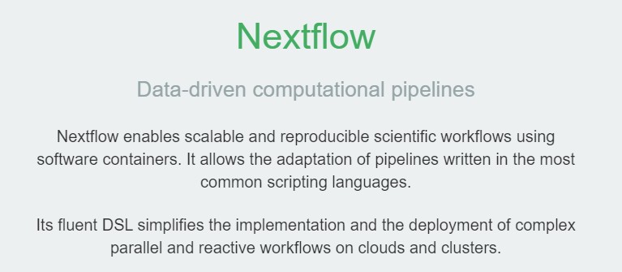
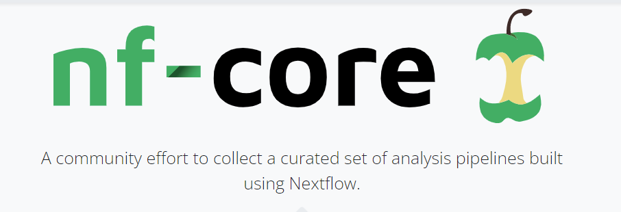
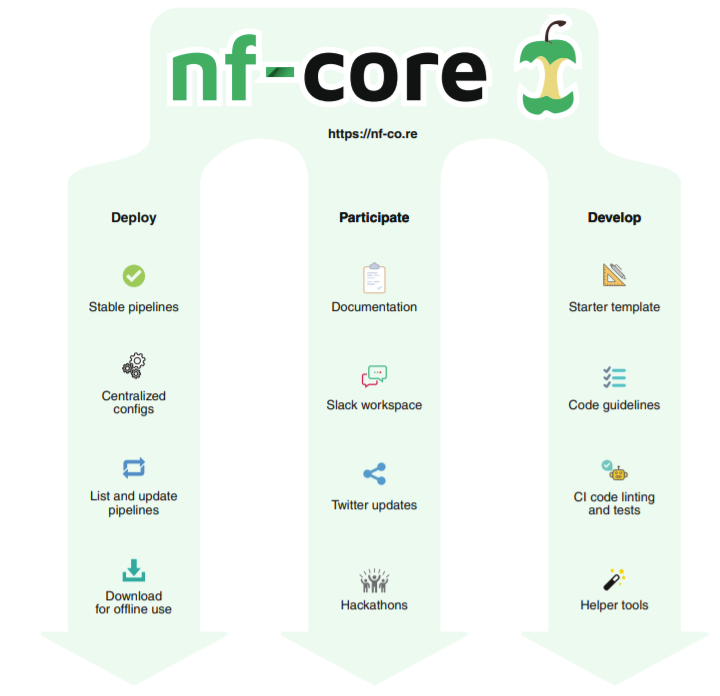
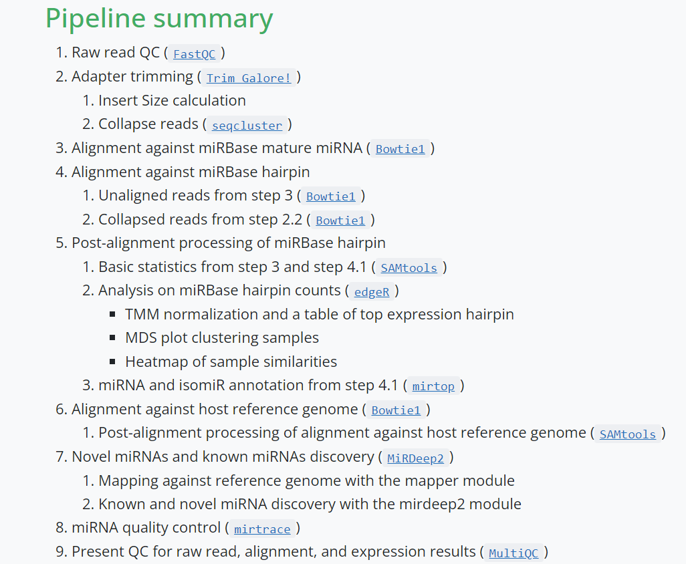
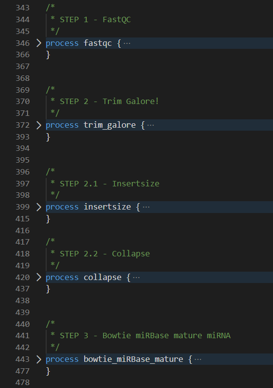
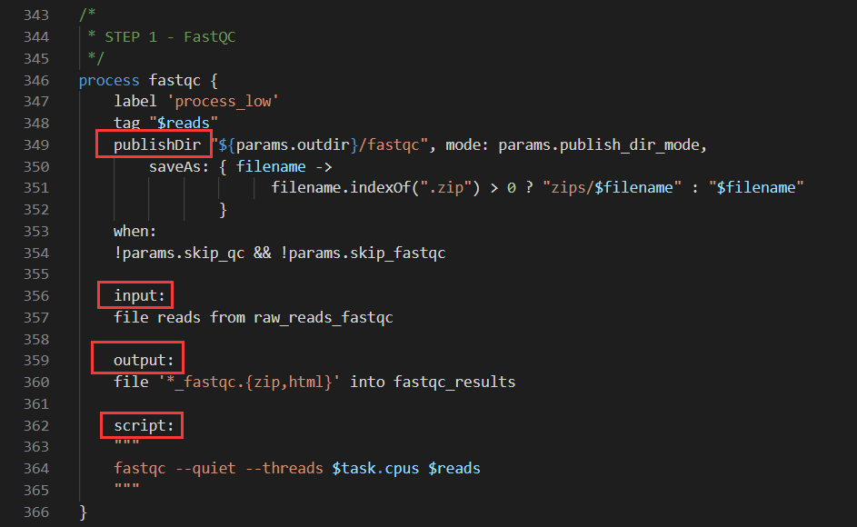

# Nextflow
This is a repo contains my working notes about nextflow and also some useful tools(scripts) I created for it.

I mainly work with nextflow and AWS together now, so there are also some notes about Cloud Computing.

I will keep updating this repo.


## What’s Nextflow & What’s nf-core?






## Structure of a Nextflow pipeline (nf-core/rnaseq)


## The Code Structure


## How to set up a nextflow process


### How to resolve mixed languages in Nextflow?
- The scripts within Nextflow just like normal Linux Shell(Command Line)
- So we can invoke any languages and tools we like with nextflow.

## What we need to run an nf-core pipeline
- Linux or MacOS System
    - Could also be used with Windows WSL (Windows Subsystem for Linux)
- Java 8 or later
- Container (like Docker, Conda, ...)
    - It helps us to install all the dependencies with only ONE command
    - For example:

        ```Docker pull nfcore/smrnaseq```


## How do we actually work with AWS and Nextflow
1. Set up the environment with AMI(Amazon Machine Image)
    - Go to ./packer for how to do this
    - Do this only once
    - It can persist the resources we need
    - Help us to start the server conveniently in the future
2. Start AWS EC2 (the cloud server)
3. Download data from AWS S3(a Bucket)
    - You need to config awscli first
        - Go to AWS website for how to do this

    ```aws s3 sync --profile=[username] s3://[data-resource-name]/ ~/data/```
4. Run the pipeline:

    ```nextflow run nf-core/rnaseq -r 3.7 -profile test,docker --input samplesheet.csv --outdir test_output```
5. Upload the processing result to AWS S3

    ```aws s3 sync --profile=[username] [processig-results] s3://[data-resource-name]```
6. Stop the server
    - To save money

### Actually, all the steps above can be done with ONE command
- I am still working with this
- Do this via ```AWS Cloudformation```
- It can automatically:
    - Start AWS Server
    - Download data
    - Finish the pipeline
    - Upload the result
- It should be able to finish all work with the following Command:

    ```aws cloudformation create-stack --profile=[user-name] --stack-name myVpc --template-body file://infra.yml```
